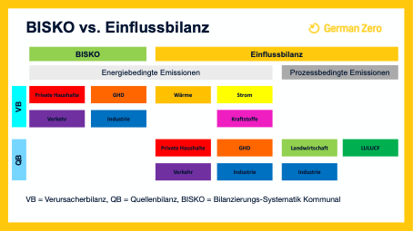
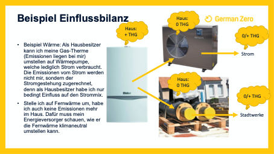
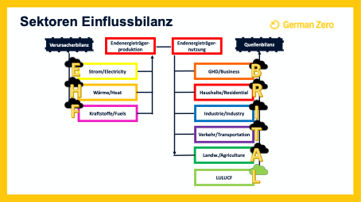

Einflussbilanz: Eine neue Methodik zur kommunalen und deutschlandweiten Bilanzierung  
====================================================================================
| **Autor: Hauke Schmülling**  
| **Stand: 22.02.22** 

 

| Ausgangslage und Problematik: 
| LocalZero soll überschlägige THG-Bilanzen für Kommunen, Landkreise und Bundesländer aufstellen, abgeleitet von der nationalen THG-Bilanz und anderen nationalen Daten, die mit kommunalen Daten gekreuzt werden. Dabei unterscheidet sich der bisherige Quasi-Standard für kommunale THG-Bilanzierung – BISKO: Bilanzierungs-Systematik Kommunal – erheblich von der nationalen Vorgehensweise und umfasst nicht alle relevanten Lebensbereiche. 

Das Umweltbundesamt selbst stellte 2020 fest:  
„Lediglich überregionale Bilanzierungsmethoden auf Landes- und Bundesebene sind, da sie zumeist einen Quellenansatz verfolgen und eher (inter)nationalen Zielvorgaben entsprechen, nur teilweise mit dem BISKO-Standard konform.“ 
https://www.umweltbundesamt.de/sites/default/files/medien/479/publikationen/cc_19-2020_endbericht_sv-gutachten_bisko.pdf  

Quellenbilanz: Es werden „alle Emissionen dargestellt, die auf den Verbrauch von Primärenergieträgern – z. B. Kohlen, Mineralöle und Gase – […] zurückgehen“. 

Verursacherbilanz: „Es fließen sowohl Primärenergieträger als auch Sekundärenergieträger – wie Wärme und Strom – in die Berechnung ein. Somit werden in einer Verursacherbilanz alle Emissionen dargestellt, die auf den Endenergieverbrauch […] bezogen sind.“ 

https://www.lak-energiebilanzen.de/methodik-der-co2-bilanzen/  

Endenergieträger = Primär- oder Sekundärenergieträger, die von einem Endverbraucher genutzt und in Nutzwärme, Produkte oder Fortbewegung umgewandelt werden 
https://www.energas-gmbh.de/glossar/endenergietraeger/  

 
| **Deutsche THG- und Energiebilanzen** 

Das deutsche Treibhausgas-Inventar, das jährlich im Nationalen Inventar Bericht (NIR) ans UNFCCC gemeldet wird, verwendet eine Quellenbilanz, d.h. alle Emissionen, die direkt vor Ort in Deutschland erzeugt werden. Import und Export werden dabei nicht berücksichtigt. 
Die energiebedingten (eb) Emissionen basieren größtenteils auf den Werten der AG Energiebilanzen und verbrennungsbezogenen Emissionsfakten. Prozessbedingte (pb) Emissionen werden mit Produktionsmodellen und produktbezogenen Emissionsfaktoren ermittelt. 

Die 6 Sektoren im NIR sind Energie (CRF 1, nur eb), Industrieprozesse (CRF 2, nur pb), Landwirtschaft (CRF 3, nur pb), LULUCF (CRF 4, „natürliche“ Quellen und Senken, damit quasi auch nur pb), Abfall und Abwasser (CRF 5, nur pb), Andere (CRF 6, nur pb). 

Das deutsche Klimaschutzgesetz sortiert diese Emissionen in 7 Sektoren um: Energiewirtschaft (nur eb), Industrie (eb+pb), Gebäude (nur eb), Verkehr (nur eb), Landwirtschaft (eb+pb), Abfallwirtschaft (CRF5+6), LULUCF (CRF 4). 

Die deutsche Energiebilanzierung wird vom AG Energiebilanzen e.V. vorgenommen. Dieser betrachtet in seiner Bilanz 2018 für Deutschland sowohl Einfuhr und Ausfuhr als auch Gewinnung und Bestand von Energieträgern. Primärenergieträger werden in der Umwandlungsbilanz teilweise verbraucht und größtenteils umgewandelt zu Endenergie. Diese wird wiederum von den Sektoren Industrie, Verkehr, Haushalte und GHD verbraucht/in Produkte umgewandelt. 

| **Kommunale THG- und Energiebilanzen** 

| Kommunale THG-Bilanzen nach BISKO-Standard sind endenergiebasierte Territorialbilanzen („In statistischen Berichten wird hier auch von der Verursacherbilanz gesprochen (Im Gegensatz zu Quellbilanzen)“). 
| https://www.ifeu.de/fileadmin/uploads/BISKO_Methodenpapier_kurz_ifeu_Nov19.pdf  
 

Als Vorarbeit zur kommunalen THG-Bilanz wird die kommunale Energiebilanz (keine Unterscheidung in Quell- oder Verursacherbilanz) üblicherweise als Endenergieverbrauch (EEV) in den Sektoren Private Haushalte, GHD, Industrie und Verkehr. Manchmal werden zudem öffentliche/kommunale Gebäude ausgewiesen.  

Im Verkehrssektor sind die THG-Emissionen nach Quellen- oder Verursacherbilanz weitestgehend identisch, da die Vorkettenemissionen der Kraftstoffe nur einen geringen Anteil haben und Strom noch nicht viel genutzt wird.  
Insbesondere in den Sektoren Industrie, Private Haushalte und GHD erfolgt statt einer Quellen- eine Verursacherbilanz. Es wird „im Bereich des Strom- und Fernwärmeverbrauchs vom klassischen Ansatz des Emissionskatasters (Quellenbilanz) zu Gunsten einer Verursacherbilanz abgewichen“.   
https://www.ifeu.de/fileadmin/uploads/BISKO_Methodenpapier_kurz_ifeu_Nov19.pdf 
D.h. der Kommune werden auch die ganzen Vorketten-Emissionen einer kWh Strom zugerechnet, obwohl diese möglicherweise nicht auf kommunalem Gebiet produziert wurde. 

Zudem werden prozessbedingte Emissionen bei BISKO nicht betrachtet:  
„In kommunalen Konzepten liegt der Schwerpunkt derzeit auf der Bilanzierung energetisch-bedingter THG-Emissionen. Dies liegt unter anderem an der geringen Datenverfügbarkeit auf kommunaler Ebene.“ 
https://www.ifeu.de/fileadmin/uploads/BISKO_Methodenpapier_kurz_ifeu_Nov19.pdf 

| **Notwendigkeit eines neuen Bilanzierungsprinzips:** 

| GermanZero möchte mit LocalZero ein Instrument zur Verfügung stellen, mit dem man überschlägig ermitteln kann, was alles in einer Kommune getan werden kann und muss, um klimaneutral zu werden. D.h. es geht zum einen darum, was die Verbraucher:innen tun können, wie es die BISKO-Methodik vorsieht, also Gebäude sanieren, mehr ÖPNV nutzen oder Strom einsparen. Zum anderen soll aber auch aufgezeigt werden, was auf der Erzeugungsseite verändert werden kann, sprich den fehlenden EE-Anteil im Bundesstrommix kommunal erzeugen oder die Wärmeversorger dekarbonisieren. 
| Auch bei prozessbedingten Emissionen sollen Maßnahmen zur Reduktion stattfinden, also weniger Rinder halten oder Stahl per Wasserstoff-Direktreduktion herstellen. 
| Summa summarum: Es sollen alle Punkte, wo jemand in der Kommune Einfluss auf die THG-Bilanz üben kann, ausgenutzt werden. Daher muss eine Erweiterung der von BISKO genutzten Sektoren erfolgen und ausgehend von den nationalen THG-Bilanzen eine Differenzierung nach Quellen- oder Verursacherbilanz. Diesen Bedingungen wird die neu entwickelte Einflussbilanz gerecht. 

Erweiterung und Differenzierung von BISKO durch die Einflussbilanz:  

| **Nebenbedingungen** 

**BISKO-Kompatibilität:**
Da LocalZero einen niedrigschwelligen Einstieg in die professionelle kommunale Bilanzierung bieten will, sollte eine Übertragbarkeit zum BISKO-Standard möglich sein. Diese Überprüfung ist derzeit noch nicht erfolgt (Stand Februar 2022), wird aber noch durch Vergleich mit BISKO-Bilanzen geschehen. 

**Gesamtrechnung stimmt:**
Wenn als „Kommune“ Deutschland (DG000000) ausgewählt wird, soll die angegebene THG-Bilanz mit der des NIR übereinstimmen und die Energiebilanz kompatibel zur AG Energiebilanzen sein. Ausnahme: Abweichungen entstehen, wenn diese Werte aktuell nicht berücksichtigt oder nur nachrichtlich ausgewiesen werden. Dies sind internationaler Flug- und Schiffsverkehr sowie Emissionen aus der Verbrennung von fester Biomasse. Außerdem weicht die Verkehrsdatengrundlage des ifeu von der AG Energiebilanzen ab. Insgesamt sind die Daten von LocalZero jeweils etwas höher beim EEV (3%), bei den cb Emissionen (5%) und den pb Emissionen (4%).  

Methodik Einflussbilanz 
-----------------------
| **Was wird auf dem Territorium bilanziert?** 

| Ansatz:  
| Emissionen werden dort bilanziert, wo man direkten Einfluss hat, sie zu ändern. 

| Beispiel Wärme:  
| Als Hausbesitzer:in kann man die Gas-Therme (Emissionen liegen bei Private Haushalte) umstellen auf Wärmepumpe, welche lediglich Strom verbraucht. Die Emissionen vom Strom werden dann dem Stromanbieter zugerechnet (Sektor Strom), denn als Hausbesitzer:in hat man nur bedingt Einfluss auf den Strommix. Stellt man auf Fernwärme um, hat man auch keine Emissionen mehr im Haus. Dafür muss der Energieversorger schauen, wie er die Fernwärme klimaneutral umstellen kann, die Emissionen liegen bei ihm (Sektor Wärme). 

| Verursacher- und Quellenbilanz: 
| Die Einflussbilanz differenziert die in BISKO enthaltenen Sektoren: Die Produktion der Endenergie wird ausgelagert in die Sektoren Strom, Wärme und Kraftstoffe und die bei der Vorkette anfallenden Emissionen nach dem Verursacherprinzip der Kommune zugerechnet. 
| Im Gegensatz dazu erfolgt die THG-Bilanzierung in den Sektoren PH, GHD, Verkehr, Industrie und BuM als Quellenbilanz: Die physikalisch tatsächlich auf dem Gebiet der Kommune anfallenden Emissionen aus der Verbrennung werden direkt der Kommune zugerechnet. 
| Somit stehen nicht wie bei BISKO nur „die Energieverbraucherinnen im Mittelpunkt der Bilanzierung“ https://repository.difu.de/jspui/handle/difu/248422 , sondern auch die Produzenten (Stromanbieter, Stadtwerke, Raffinerien).  
| Außerdem erweitert die Einflussbilanz BISKO um prozessbedingte Emissionen aus Industrie, Landwirtschaft und LULUCF. Auch in den Sektoren Wärme und Kraftstoffe fallen pb Emissionen z.B. bei der Raffination an und werden mitbilanziert. 

| Prinzip innerhalb eines Sektors:  
| THG-Emissionen werden auf der Nachfrage-Seite bilanziert, wenn es sich um „prozessbedingte“ Emissionen handelt (Industrie, Landwirtschaft, LULUCF), und auf Bereitstellung-Seite, wenn es sich um „verbrennungsbedingte“/“energiebedingte“ Emissionen handelt (Strom, Wärme, Kraftstoffe, Haushalte, GHD, Betriebe und Maschinen (BuM) in Landwirtschaft). Eine Ausnahme bildet Verkehr, da der Verbrauch der Kraftstoffe und damit die THG-Emissionen schon spezifisch den Verkehrsträger zugeordnet werden. Ähnlich erfolgt die Allokation in Industrie, da Produktionsprozesse sowohl eb als auch pb Emissionen enthalten, die darum zusammen dem jeweiligen Industriezweig zugeschrieben werden. 

Sektoren Einflussbilanz 
-----------------------
Es gibt zwei Gruppen von Sektoren: 
 
#. Produktion von Endenergie (Vorkette). Es werden die Endenergieträger Strom (Sektor Strom), Heizöl, sonstige Mineralölprodukte, Kohle, LPG, Erdgas, sonstige fossile Energieträger, Fernwärme, Biomasse (alle Sektor Wärme) Benzin, Diesel, Kerosin, Bioethanol, Biodiesel, Biogas, E-Methan, Wasserstoff (alle Sektor Kraftstoffe) bereitstellt. Die erneuerbaren Endenergieträger Solarthermie und Wärmepumpe werden der Vollständigkeit halber in Wärme aufgeführt, aber eigentlich in den Sektoren PH, GHD und Landwirtschaft privat vor Ort produziert. Verursacherbilanz: Der Kommune werden die THG-Emissionen zugeschrieben, die bei der Vorkette (Produktion der Endenergieträger in Deutschland) entstehen. 

#.  Produktion von Endprodukten (Nutzung von Endenergieträgern). Die Endenergieträger werden von einem Endverbraucher genutzt und in Raumwärme und Warmwasser sowie andere Anwendungen (PH, GHD, BuM), Produkte (Industrie) oder Fortbewegung (Verkehr) umgewandelt. Die Emissionen aus der Produktion landwirtschaftlicher Produkte und aus LULUCF sind unabhängig von Endenergie und werden daher auf Grundlage von Tierzahlen und Flächen berechnet. Quellenbilanz: Der Kommune werden die THG-Emissionen zugeschrieben, die direkt vor Ort durch die Produktion von Gütern oder Leistungen (durch Nutzung der Endenergieträger) entstehen. 

 