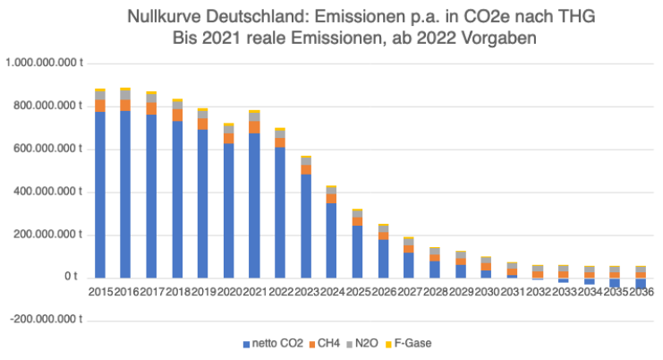
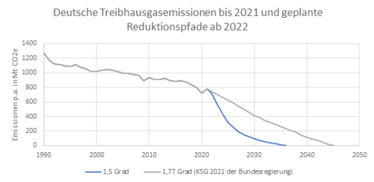
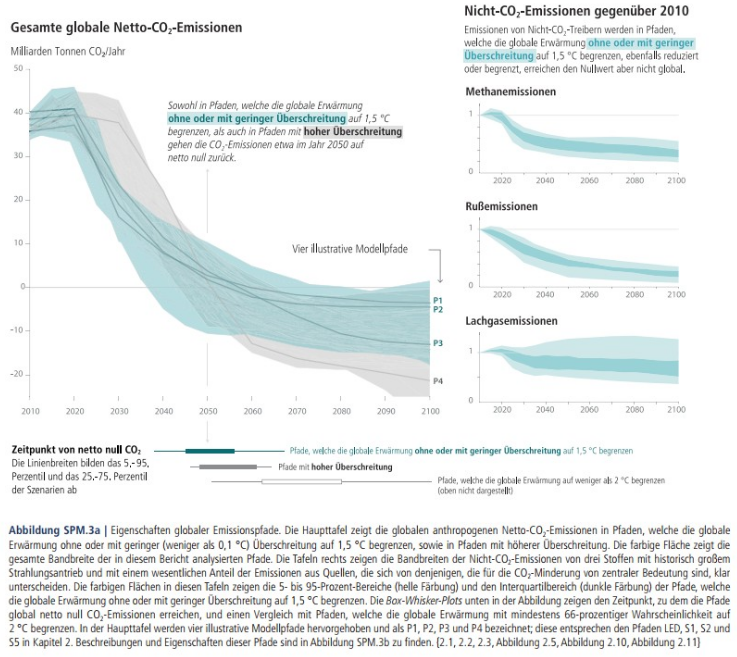
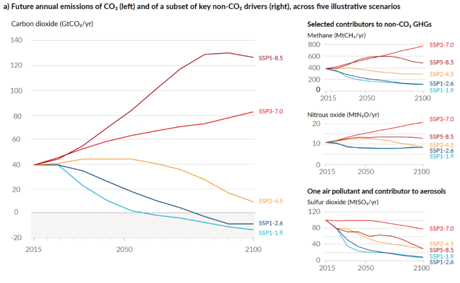

Ermittlung eines deutschen Treibhausgasbudgets 2016-2035 mit dem NCG-Ansatz
===========================================================================
| **Autor: Hauke Schmülling**
| **Stand: 22.02.22**

| **Zusammenfassung**
| Mit dem neuartigen NCG-Ansatz zur Budgetierung von non-CO2-Treibhausgasen wird das Gesamtbudget für Deutschland zu 7,9 Gt CO2e im Zeitraum 2016-2035 bestimmt.
| Zum 01.01.2022 sind davon voraussichtlich noch 3,0 Gt CO2e übrig.
| Die Bundesregierung plant mit dem Klimaschutzgesetz 2021 im Zeitraum 2016-2045 12,8 Gt CO2e zu emittieren und zielt damit auf eine globale Erwärmung von 1,77 Grad.

| **Ausgangspunkt**
| In Deutschland werden vom Umweltbundesamt (UBA) im Rahmen des National Inventory Report (NIR) als Treibhausgase (THG) CO2, CH4, N2O und F-Gase berichtet. Die non-CO2-THG machen etwa 13,6% (2020) der deutschen THG (inkl. LULUCF) aus.
| Wir haben uns gewundert, warum die Diskussion sich fast ausschließlich um CO2 dreht. Insbesondere wenn es um „das“ Budget geht, sind lediglich die noch erlaubten CO2-Emissionen basierend auf Zahlen des „Special Report on Global Warming of 1,5°C“ (SR15, 2018) bzw. dem Sixth Assessment Report (AR6, 2021) vom IPCC gemeint. Daher möchten wir ein THG-Budget aufstellen, inklusive aller (in Deutschland berichteter) non-CO2-THG. Bisher scheint aber noch niemand so etwas konkret gemacht zu haben, weswegen wir das gerne in den öffentlichen Diskurs einbringen würden. 
| Der einzige uns bekannte Ansatz in diese Richtung stammt aus der Wuppertal-Studie vom Herbst 2020 für Fridays for Future auf S. 35/36:
| „Hierfür wurde für beide Budgets eine Minderung um 40 Prozent bis 2040 angenommen (mit anschließender Trendfortsetzung). Diese Annahme orientiert sich grob an den Annahmen zur globalen Entwicklung dieser Emissionen unter globalen 1,5-°C-Pfaden im 1,5-°C-Bericht des IPCC (2018b, Abb. SPM.3a).“

| **Kurzbeschreibung**
| Die grobe Annahme des Wuppertal-Instituts haben wir versucht mit dem neuen non-CO2-grandfathering-Ansatz (NCG-Ansatz) zu verfeinern und in konkrete Zahlen zu gießen. Wir haben drei einzelne Budgets in CO2-Äquivalenten (CO2e [GWP100]) für die Treibhausgase CH4, N2O und F-Gase entwickelt, jeweils für den Zeitraum 2016-2035. Im Gegensatz zum zeitunabhängigen und pro Kopf ermittelten reinen CO2-Budget, wie es z.B. der SRU vorgemacht hat und wir es ebenfalls tun, ist der Ansatz hier anders. Figure SPM.3a auf S. 13 des SR15 bzw. Figure SPM 4 auf SPM-16 des AR6 (siehe unten) zeigen, wie sich die non-CO2-THG parallel zum festen-CO2-Budget-Reduktionspfad entwickeln müssen, um global die 1,5-Grenze ohne oder mit geringer Überschreitung (max. 1,6 Grad) einzuhalten.
| Diese non-CO2-THG-Reduktionspfade haben wir ausgehend vom Basisjahr 2015 in Prozentpunkte umgewandelt und auf die deutschen Emissionsmengen 2015 angewendet. Damit folgen wir hier einer Minderungspfad-Logik des „jeder in gleichem Minderungs-Tempo von seinem Niveau“ („grandfathering“), anstatt des „jeder Kopf hat dasselbe Restbudget“ (vgl. Interpretation 5 bzw. 1 des SRU 2020 S.48). Somit handelt es sich nicht um ein festes Budget wie bei CO2, sondern um die zeitraumabhängige Summe jährlicher Emissionsgrenzen.

| **Vorgehen und Ergebnisse des NCG-Ansatzes**

#. Exportiert wurden die data sets für die “OECD+EU27” und das Szenario “no or limited overshoot” mit den Variablen „CH4“, „N2O“ und „F-Gases“ (jeweils „TOTAL“) von IIASA https://data.ene.iiasa.ac.at/iamc-1.5c-explorer/#/workspaces/, die Grundlage sind für Figure SPM.3a des SR15 bzw. Figure SPM 4 des AR6. Daraus wurden die durchschnittlichen Emissions-Ziele für 2020, 2025, 2030, 2035, 2040, 2045 und 2050 ermittelt. Basierend auf dem Emissions-Durchschnitt von 2015 wurden diese Werte zu Prozentpunkten umgewandelt und linear regressiert innerhalb der 5-Jahres-Zeiträume.

#. Die deutschen Emissionsmengen von 2015 nach THG wurden als Ausgangswerte genommen und mit den zuvor berechneten OECD90+EU27 Prozentpunkten bis 2035 multipliziert. Diese Zielemissionswerte wurden dann für die 20-Jahres-Periode 2016-2035 aufsummiert und als Budget gesetzt. 790 Mt CO2e für CH4, 630 Mt CO2e für N2O, 170 Mt CO2e für F-Gase ergeben in Summe 1,6 Gt CO2e für non-CO2-THG.

#. Das CO2-Budget wurde “klassisch” mit 66,6 Perzentilen für 1,5 Grad (400 Gt CO2 ab 01.01.2020 (AR6 SPM-38), pro Kopf (82,1 Mio. Deutsche vs. 7,35 Mrd. Weltbevölkerung am 31.12.2015) und zurück zum 01.01.2016 (+167 Gt CO2 für 2016-2019 https://essd.copernicus.org/articles/12/3269/2020/#section3 ) berechnet, sodass man auf 6,3 Gt CO2(e) für CO2 kommt (Methodik vgl. SRU 2020 S.52). In Summe erhalten wir so 7,9 Gt CO2e als deutsches THG-Budget für den Zeitraum 2016-35.

| **Begründung**
| Den NCG-Ansatz halten wir aus folgenden Gründen für legitim:

#. Im Gegensatz zum CO2-Budget drehen wir den Spieß hier um: das Budget wird aus Pfaden ermittelt. Dabei ist es logisch, wenn die Pfade überall vom Ausgangspunkt geschmeidig aber ambitioniert runter gehen. Mit dem pro-Kopf-Ansatz würden wir zunächst aus Pfaden für ein Zeitintervall ein Budget ermitteln, dieses pro Kopf aufteilen und die Länder müssten dann wieder Pfade für das Zeitintervall erarbeiten. Für ein folgendes oder anderes Zeitintervall würden dann eventuell nicht konsistente Länder-Reduktionspfade entstehen. Der NCG-Ansatz verspricht Konsistenz und langfristige Planbarkeit.

#. Durch die Pfade gibt es keine finalen Budgets, sondern nur solche für Zeitintervalle. Ab 2035 darf man auf dem niedrigeren Niveau weiter non-CO2-THG emittieren. Mit dem pro-Kopf-Ansatz hätten wir dann ggf. eine zeitliche Lücke, in der wir nicht emittieren dürfen, und danach wäre es wieder okay, was nicht wirklich sinnvoll wäre.

#. Es ist „genug für alle“ da. Also im Gegensatz zu CO2, wo eigentlich für kein Land ein verträglicher geschmeidiger Reduktionspfad besteht, könnten bei den non-CO2-THG alle Länder entspannt im gleichen Takt (je nach Region) reduzieren. Wenn wir pro Kopf aufteilen, wird es Länder geben, die ihr Emissionsniveau sogar noch erhöhen dürften. Die Länder-spezifische Betrachtung erlaubt zudem die Nutzung der 5 Regionen statt einfach World (bei den IIASA Daten) und damit sind die realisierbaren Reduktionsmöglichkeiten besser dargestellt.

#. | Mit dem NCG-Ansatz würde man Deutschland für 2016-35 ein kleineres Budget zuweisen als mit dem pro-Kopf-Ansatz, da Deutschland im weltweiten Vergleich sowieso schon recht wenig Methan emittiert.  Für den pro-Kopf-Ansatz wurden die weltweiten non-CO2-THG-Pfade 2016-2035 direkt aufsummiert, natürlich mit den IIASA Daten der Region „World“. Im Gegensatz zu den deutschen Emissionen 2015 sind die weltweiten Emissionen mit starken Unsicherheiten behaftet. Um quellentreu zu sein, wurden die Mittelwerte der IIASA Daten 2015 als Ausgangswerte verwendet. Auch diese divergieren, da es Szenario-Projektionen ausgehend von 2010 sind. Ein Vergleich mit Daten vom Global Carbon Project und climatewatchdata.org zeigte jedoch eine zufriedenstellende Übereinstimmung (max. 24% Abweichung untereinander).
   | Diese globalen non-CO2-THG-Budgets wurden dann pro Kopf (82,1 Mio. Deutsche vs. 7,35 Mrd. Weltbevölkerung am 31.12.2015) zu 1,1% auf Deutschland aufgeteilt und zeigen folgendes Ergebnis (vorne pro-Kopf-, hinten NCG-Ansatz):
   | CH4: 1.740 Mt CO2e statt 790 Mt CO2e.
   | N2O: 610 Mt statt 630 Mt.
   | F-Gase: 180 Mt statt 170 Mt.
   | Gesamt non-CO2-THG-Budget 2016-35: 2.530 Mt CO2e statt 1.590 Mt CO2e.

| **Schlussfolgerung, Nullkurve und Vergleich mit Bundesregierung**
| Basierend auf den vom UBA veröffentlichten Emissionen 2016-2020 bleiben vom 7,9 Gt CO2e THG-Budget (2016-2035) Deutschlands zum 01.01.2021 noch 3,8 Gt CO2e übrig. Der Emissionsschätzung des Öko-Instituts folgend werden 2021 voraussichtlich 0,8 Gt CO2e emittiert (https://www.oeko.de/fileadmin/oekodoc/Hochrechnung-der-deutschen-THG-Emissionen-2021.pdf ), sodass zum 01.01.2022 noch 3,0 Gt CO2e als Budget übrig blieben.
| Mit „Wunschwerten“ beginnend im Jahr 2022 wurde eine „Nullkurve“ skizziert, welche deutsche Klimaneutralität 2035 ermöglichen würde sowie im THG-Budget bleibt. Alle darüber liegenden Emissionen müssten dann im Ausland kompensiert werden.
| Zum Vergleich wurden die geplanten Emissionen bis 2045 der Bundesregierung im Klimaschutzgesetz 2021 mit dem beschriebenen NCG-Ansatz zurückgerechnet. Für die Periode 2016-2045 plant die Bundesregierung 12,8 Gt CO2e, davon 7,9 Gt CO2e ab 2022. Die erlaubten non-CO2-THG für diesen Zeitraum betragen nach dem NCG-Ansatz 2,1 Gt CO2e. Dementsprechend nimmt die Bundesregierung 10,7 Gt CO2 ab 2016 in Kauf. Mit der Weltbevölkerung von 2016 entspräche das 958 Gt CO2 ab 2016 bzw. 791 Gt CO2 ab 2020. Entsprechend der Tabelle 5.8 auf S. 5-96 des AR6 korrespondiert dies bei 66,6 Perzentilen einem Temperaturanstieg von 1,77 Grad gegenüber dem vorindustriellen Zeitalter. Bei einem aktuellen Stand von 1,07 Grad (2010-2019) plant die Bundesregierung also, das 1,5-Grad-Limit um 0,27 Grad zu überschreiten. Der NCG-Ansatz erlaubt somit einen anschaulichen Vergleich zwischen den THG-Zielen der Bundesregierung (CO2 und non-CO2) und den CO2-Budgets des IPCC.

| **Ermittlung des kommunalen THG-Budgets**
| Zur Berechnung des kommunalen Budgets könnte man im Prinzip genauso vorgehen wie für Deutschland: Das CO2-Budget wird pro Kopf ab 2016 aufgeteilt und das non-CO2-THG-Budget wird ausgehend von den non-CO2-THG im Jahr 2015 ermittelt. Hier tritt jedoch ein Problem auf: Da bereits die Allokation von pb und cb Emissionen erhebliche Schwierigkeiten bereitete, wurde vom LocalZero-Team entschieden, die THG-Bilanzierung vereinfachend in CO2e zu machen und die THG nicht in CO2, CH4, N2O und zahlreiche F-Gase zu unterscheiden. Somit steht in der überschlägig ermittelten kommunalen THG-Bilanz 2018 kein non-CO2-THG-Anteil zur Verfügung. Die einfachste Annahme wäre, hier den gleichen Anteil wie auf nationaler Ebene anzunehmen. Daher wird das THG-Budget, das wie oben beschrieben für Deutschland abhängig vom Zieljahr der Klimaneutralität ermittelt wird, mit der Einwohnerzahl der Kommune runterskaliert.

| **Der kommunale Reduktionspfad**
| Die kommunale Treibhausgasbilanz 2018 wird mit der deutschen Entwicklung von 2016-2021 skaliert. Diese sechs Emissionszahlen werden vom kommunalen THG-Budget abgezogen und so ein verbleibendes THG-Budget ab dem 01.01.2022 ermittelt. Auch wenn der Reduktionspfad abhängig vom Zieljahr eher einem durchhängenden Seil entsprechen sollte (wie oben die modellierte Nullkurve für Deutschland), wurde dieser aus Berechnungsgründen als linear angenommen. Denn zwei Variablen würden eine flexible Kurvenanpassung bei bekanntem kommunalem THG-Budget benötigen: Je höher die Ausgangsemissionen sind und je später das Zieljahr der Klimaneutralität gewählt wird, desto schneller müsste der Abfall erfolgen, um das Integral der Emissionen mit dem THG-Budget gleichzusetzen. Dieser Komplexität wurde mit dem linearen Reduktionspfad begegnet, wodurch das THG-Budget je nach Zieljahr aber unter- oder überschritten werden kann. Hier bedarf es der Interpretation vor Ort: Ist der Wert des „verbleibenden“ THG-Budgets nach dem Zieljahr negativ, wurde das THG-Budget überschritten und innerhalb des Umsetzungszeitraums müssen weitere Maßnahmen (eventuell extraterritorial) ergriffen werden, um diese Lücke auszugleichen und diese Emissionen der Atmosphäre wieder zu entziehen (siehe Kapitel LULUCF). Klimaneutralität bedeutet dabei netto 0 THG-Emissionen, d.h. es wird auch im Zieljahr und danach noch Sockelemissionen unseres Wirtschaftens geben, die jedoch auf dem Gebiet der Kommune ausgeglichen werden.

| **Frage: „Gelten die Non-CO2-THG-Reduktionspfade des IPCC nicht nur in Verbindung mit Klimaneutralität 2050?“** 
| Antwort geben Grafik SPM.3a und grundlegende Überlegungen des Gesamtbudget-Ansatzes: 
| Die non-CO2-Pfade aus SPM.3a sind beschriftet mit „Emissions of non-CO2 forcers are also reduced or limited in pathways limiting global warming to 1.5°C with no or limited overshoot, but they do not reach zero globally.” 
| An der CO2-Kurve steht: „In pathways limiting global warming to 1.5°C with no or limited overshoot as well as in pathways with a higher overshoot, CO2 emissions are reduced to net zero globally around 2050.” 
| Diese netto CO2-Neutralität muss weltweit 2050 gelten, flankiert von den nicht 0 erreichenden non-CO2-THG-Pfaden. Dass Deutschland als überproportionaler CO2-Emittent sein Budget bereits früher aufgebraucht haben wird bzw. zur netto CO2-Neutralität kommen muss, bedeutet aber nicht, dass seine non-CO2-THG-Reduktionspfade sich nicht wie die der anderen Länder (OECD+EU27) verhalten können. Denn im Gegensatz zu CO2, wo ein quantifizierbares und endliches Budget zur Verfügung steht, können alle Länder gleichmäßig nach dem hier gewählten NCG-Ansatz von ihrem Ausgangs-Emissionsniveau 2015 ihre non-CO2-THG herunterfahren, um das weltweite Ziel zu erreichen.

    SR1.5 Figure SPM.3.a

| **Anmerkung zur Übertragbarkeit der Daten des SR1.5 auf AR6:**
| Sowohl 2018 als auch 2021 wurden die selben scenario data sets verwendet (siehe AR6 SPM-38, TS-62). Das Szenario SSP1-1.9 ist lediglich ein bestimmtes Szenario, welches die Erderwärmung auf max. 1,6 Grad im mittleren Zeithorizont beschränkt (AR6 SPM-18). Dieses liegt im Range der 2018 veröffentlichten „Pfade, welche die globale Erwärmung ohne oder mit geringer Überschreitung auf 1,5 Grad begrenzen“ (SR1.5 S. 13), bildet aber nicht den Median ab.

    AR6 Figure SPM.4: Future anthropogenic emissions of key drivers of climate change and warming contributions by groups of drivers for the five illustrative scenarios used in this report. 

| Während die Emissionspfade der non-CO2-THG sich von 2018 zu 2021 nicht verändert haben, hat sich das weltweite CO2-Budget des 1,5-Grad-Limits für 66,6 Perzentile scheinbar erhöht: von 420 Gt CO2 2018 auf 400 Gt CO2 2020 bei gleichzeitigen Emissionen von etwa 84 Gt CO2 in den Jahren 2018-2019 (https://essd.copernicus.org/articles/12/3269/2020/#section3).
| Tatsächlich ist der Grund für das höhere CO2-Budget jedoch nur eine Verbesserung der Ungenauigkeit des transient climare response to cumulative carbon emission (TCRE) range, also des Proportionalitätsfaktor zwischen dem Anstieg der CO2-Konzentration in der Atmosphäre und dem Anstieg der Temperatur. Im AR6 ist auf S. 1250 zu lesen: “The new and narrower assessment of TCRE in AR6 compared to SR1.5 (likely range of 1.0–2.3°C EgC-1 compared to 0.8–2.5°C EgC-1, respectively, with the same central estimate) leads to no change in median estimates and about a 50 and 100 GtCO2 increase in remaining carbon budgets estimates at the 67th percentile in AR6 compared to SR1.5 for 1.5°C and 2°C of global warming, respectively.”